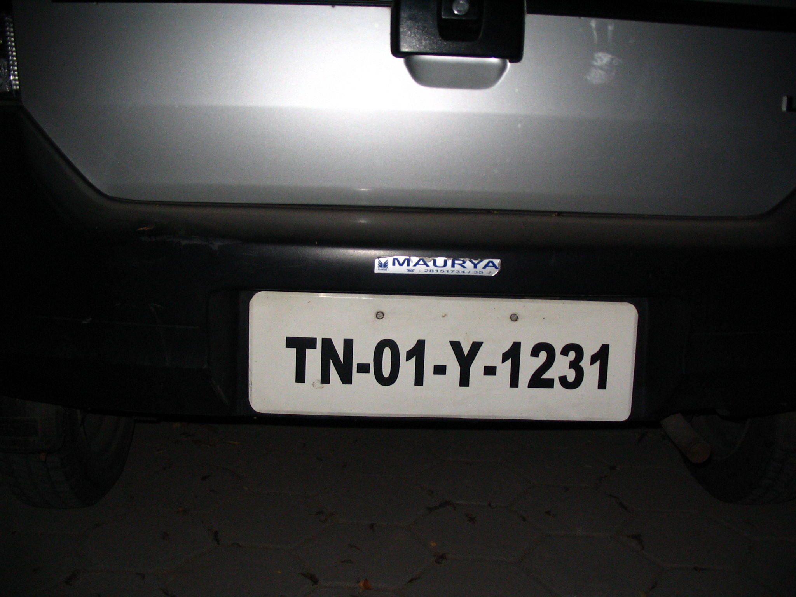
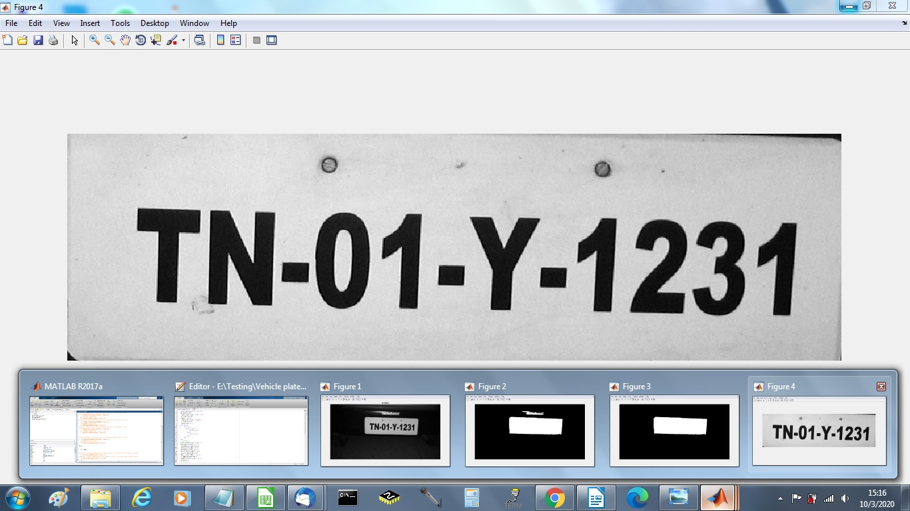

# Vehicle Number Plate Detection

## Overview
This project implements **Vehicle Number Plate Detection** using **MATLAB**. The system processes an image of a vehicle, extracts the number plate area, and applies image processing techniques to segment and highlight the characters on the plate.

## Features
- Reads an image of a vehicle using `uigetfile`.
- Converts the image to grayscale.
- Extracts the **License Plate (LP) Area**.
- Applies **thresholding**, **median filtering**, and **morphological operations**.
- Labels connected components to detect the number plate region.

## Prerequisites
- MATLAB installed on your system.
- Basic knowledge of MATLAB image processing toolbox.

## Installation & Usage
```bash
git clone https://github.com/yashitz07/AutoPlate-Detector.git
cd vehicle-number-plate-detection
```
## Installation & Usage
1. Open **MATLAB** and navigate to the project directory.
2. Run `number_plate_detection.m`.
3. Select an image file when prompted.
4. The processed image with the detected number plate will be displayed.

## Methods Used
This project primarily relies on **image processing techniques** rather than machine learning, making it computationally efficient and lightweight.

### 1. Image Preprocessing
- **Grayscale Conversion**: Reduces computational complexity by eliminating color channels.
- **Region of Interest Selection**: Extracts the probable license plate area based on empirical assumptions.

### 2. Thresholding & Filtering
- **Thresholding**: Converts the image to binary format, isolating bright regions (license plate characters).
- **Morphological Operations**: `bwfill` fills holes in binary objects, ensuring continuity.
- **Median Filtering**: Removes noise and smooths the image, improving segmentation accuracy.

### 3. Connected Component Analysis
- **`bwlabel`**: Labels connected regions in the binary image.
- **Region Properties (`regionprops`)**: Extracts bounding boxes and orientation to filter out non-license plate regions.
- **Bounding Box Selection**: Identifies the correct license plate area by filtering based on area constraints.

## Why This Approach is Better?
- **Lightweight & Fast**: Unlike deep learning-based models, this method does not require a large dataset or high computational power.
- **Effective for Standardized Plates**: Works well on vehicles with uniform plate positions and illumination.
- **No Training Required**: Since it's based on classical image processing, it does not need training data.
- **Interpretable**: The step-by-step filtering ensures that every stage is understandable and tunable.

## Code Explanation

### Step 1: Read and Preprocess Image
```matlab
a = imread(uigetfile('.jpg'));
a = rgb2gray(a);
figure; imshow(a); title('Car');
```
Loads an image and converts it to grayscale.

### Step 2: Extract License Plate Region

Extracts the lower third of the image, assuming the number plate is present there.

### Step 3: Thresholding & Filtering

Binarizes the image and applies median filtering to reduce noise.

### Step 4: Connected Component Analysis

Identifies and labels connected components.

Filters out small regions that are not part of the number plate.

### Step 5: Extract and Display Number Plate

Extracts the bounding box of the detected number plate and displays it.

## Sample Results

### Input Image
An example input image of a vehicle with a visible license plate.

### Detected Number Plate
The processed image highlighting the extracted number plate region.

## Future Improvements
- **Implement Optical Character Recognition (OCR)** to extract plate numbers.
- **Enhance accuracy** using deep learning-based approaches.
- **Improve robustness** for different lighting conditions and angles.

## License
This project is open-source and available under the **MIT License**.

🚀 **Developed by Your Name**
